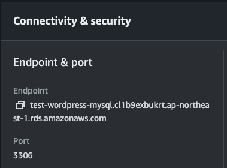

# AWS_terraform

## reference

- [EC2 インスタンスのコスト比較 | Vantage](https://instances.vantage.sh/)

# Mattermost setup command on amazon linux 2

```
   ,     #_
   ~\_  ####_
  ~~  \_#####\
  ~~     \###|
  ~~       \#/ ___
   ~~       V~' '->
    ~~~         /
      ~~._.   _/
         _/ _/
       _/m/'

sudo amazon-linux-extras install docker -y
sudo yum install git -y
sudo systemctl enable --now docker
sudo mkdir -p /usr/local/lib/docker/cli-plugins
sudo chmod -R 777 /usr/local/lib/docker/cli-plugins
cd /usr/local/lib/docker/cli-plugins
curl -OL https://github.com/docker/compose/releases/download/v2.26.1/docker-compose-linux-x86_64
mv docker-compose-linux-x86_64 docker-compose
chmod +x docker-compose
cd
git clone https://github.com/mattermost/docker && cd docker
cp env.example .env
mkdir -p ./volumes/app/mattermost/{config,data,logs,plugins,client/plugins,bleve-indexes}
sudo chown -R 2000:2000 ./volumes/app/mattermost
```

fix .env

```
DOMAIN=52.197.187.210
TZ=Asia/Tokyo
POSTGRES_IMAGE_TAG=16-alpine
MATTERMOST_IMAGE=mattermost-team-edition
MATTERMOST_IMAGE_TAG=release-9.6.1
MM_SERVICESETTINGS_SITEURL=https://sandbox-chat.okmtdev.com
```

# SSL settings

```
bash scripts/issue-certificate.sh -d sandbox-chat.okmtdev.com -o ${PWD}/certs
```

```
sudo chmod +rx certs/etc/letsencrypt/live
sudo chmod +rx certs/etc/letsencrypt/archive
```

fix .env

```
CERT_PATH=./certs/etc/letsencrypt/live/${DOMAIN}/fullchain.pem
KEY_PATH=./certs/etc/letsencrypt/live/${DOMAIN}/privkey.pem
```

install nginx

```
sudo amazon-linux-extras install nginx1 -y
```

create conf file

```
sudo vim /etc/nginx/conf.d/mattermost.conf

# mattermost
# config can be tested on https://www.ssllabs.com/ssltest/ and a good nginx config generator
# can be found at https://ssl-config.mozilla.org/

# proxy cache
proxy_cache_path /var/cache/nginx levels=1:2 keys_zone=mattermost_cache:10m max_size=3g inactive=120m use_temp_path=off;

# upstream used in proxy_pass below
# upstream backend {
    # ip where Mattermost is running; this relies on a working DNS inside the Docker network
    # and uses the hostname of the mattermost container (see service name in docker-compose.yml)
#    server mattermost:8065;
#    keepalive 64;
#}

# vhosts definitions
server {
    server_name sandbox-chat.okmtdev.com;
    listen 80 default_server;
    listen [::]:80 default_server;

    # redirect all HTTP requests to HTTPS with a 301 Moved Permanently response.
    return 301 https://$host$request_uri;
}

server {
    server_name sandbox-chat.okmtdev.com;
    listen 443 ssl http2 default_server;
    listen [::]:443 ssl http2 default_server;

    # logging
    access_log /var/log/nginx/mm.access.log;
    error_log /var/log/nginx/mm.error.log warn;

    # gzip for performance
    gzip on;
    gzip_vary on;
    gzip_proxied any;
    gzip_comp_level 6;
    gzip_types text/plain text/css text/xml application/json application/javascript application/rss+xml application/atom+xml image/svg+xml;

    ## ssl
    # ssl_dhparam /dhparams4096.pem;
    ssl_session_timeout 1d;
    ssl_session_cache shared:MozSSL:10m;
    ssl_session_tickets off;

    # intermediate configuration
    ssl_protocols TLSv1.2 TLSv1.3;
    ssl_ciphers ECDHE-ECDSA-AES128-GCM-SHA256:ECDHE-RSA-AES128-GCM-SHA256:ECDHE-ECDSA-AES256-GCM-SHA384:ECDHE-RSA-AES256-GCM-SHA384:ECDHE-ECDSA-CHACHA20-POLY1305:ECDHE-RSA-CHACHA20-POLY1305:DHE-RSA-AES128-GCM-SHA256:DHE-RSA-AES256-GCM-SHA384;
    ssl_prefer_server_ciphers off;

    # certs sent to the client in SERVER HELLO are concatenated in ssl_certificate
    ssl_certificate /home/ec2-user/docker/certs/etc/letsencrypt/live/sandbox-chat.okmtdev.com/fullchain.pem;
    ssl_certificate_key /home/ec2-user/docker/certs/etc/letsencrypt/live/sandbox-chat.okmtdev.com/privkey.pem;

    # enable TLSv1.3's 0-RTT. Use $ssl_early_data when reverse proxying to prevent replay attacks.
    # https://nginx.org/en/docs/http/ngx_http_ssl_module.html#ssl_early_data
    ssl_early_data on;

    # OCSP stapling
    ssl_stapling on;
    ssl_stapling_verify on;
    #resolver 1.1.1.1;

    # verify chain of trust of OCSP response using Root CA and Intermediate certs
    #ssl_trusted_certificate /etc/ssl/certs/ca-certificates.crt;

    ## security headers
    # https://securityheaders.com/
    # https://scotthelme.co.uk/tag/security-headers/
    add_header X-Frame-Options "SAMEORIGIN" always;
    add_header X-XSS-Protection "1; mode=block" always;
    add_header X-Content-Type-Options "nosniff" always;
    add_header Referrer-Policy no-referrer;
    add_header Strict-Transport-Security "max-age=63072000" always;
    add_header Permissions-Policy "interest-cohort=()";

    ## locations
    # ACME-challenge
    location ^~ /.well-known {
        default_type "text/plain";
        root /usr/share/nginx/html;
        allow all;
    }

    # disable Google bots from indexing this site
    location = /robots.txt {
        add_header Content-Type text/plain;
        return 200 "User-agent: *\nDisallow: /\n";
    }

    location ~ /api/v[0-9]+/(users/)?websocket$ {
        proxy_set_header Upgrade $http_upgrade;
        proxy_set_header Connection "upgrade";
        client_max_body_size 50M;
        proxy_set_header Host $http_host;
        proxy_set_header X-Real-IP $remote_addr;
        proxy_set_header X-Forwarded-For $proxy_add_x_forwarded_for;
        proxy_set_header X-Forwarded-Proto $scheme;
        proxy_set_header X-Frame-Options SAMEORIGIN;
        proxy_set_header Early-Data $ssl_early_data;
        proxy_buffers 256 16k;
        proxy_buffer_size 16k;
        client_body_timeout 60;
        send_timeout 300;
        lingering_timeout 5;
        proxy_connect_timeout 90;
        proxy_send_timeout 300;
        proxy_read_timeout 90s;
        proxy_http_version 1.1;
        proxy_pass http://127.0.0.1:8065;
    }

    location / {
        client_max_body_size 50M;
        proxy_set_header Connection "";
        proxy_set_header Host $http_host;
        proxy_set_header X-Real-IP $remote_addr;
        proxy_set_header X-Forwarded-For $proxy_add_x_forwarded_for;
        proxy_set_header X-Forwarded-Proto $scheme;
        proxy_set_header X-Frame-Options SAMEORIGIN;
        proxy_set_header Early-Data $ssl_early_data;
        proxy_buffers 256 16k;
        proxy_buffer_size 16k;
        proxy_read_timeout 600s;
        proxy_cache mattermost_cache;
        proxy_cache_revalidate on;
        proxy_cache_min_uses 2;
        proxy_cache_use_stale timeout;
        proxy_cache_lock on;
        proxy_http_version 1.1;
        proxy_pass http://127.0.0.1:8065;
    }
}
```

start nginx

```
sudo systemctl restart nginx
sudo systemctl status nginx
```

start

```
sudo docker compose -f docker-compose.yml -f docker-compose.without-nginx.yml up -d
```


stop

```
sudo docker compose -f docker-compose.yml -f docker-compose.nginx.yml down
```

# Mail server

Amazon SES

- Set SMTP Username to [YOUR_SMTP_USERNAME]
- Set SMTP Password to [YOUR_SMTP_PASSWORD]
- Set SMTP Server to email-smtp.ap-northeast-1.amazonaws.com
- Set SMTP Port to 465
- Set Connection Security to TLS

- [メールサーバ作成 | Qiita](https://qiita.com/tumu1632/items/7f6106ec872a89b47f49)

mattermost-1 | {"timestamp":"2024-04-01 04:18:32.410 +09:00","level":"warn","msg":"Failed to send welcome email on create user with inviteId","caller":"app/user.go:165","path":"/api/v4/users","request_id":"uuwjkhxgjpy15djxuzku3kkmgw","ip_addr":"172.20.0.1","user_id":"","method":"POST","error":"authentication failed: 535 Authentication Credentials Invalid"}

# WordPress の環境構築

```
$ sudo yum install httpd -y

$ sudo systemctl start httpd

$ sudo systemctl enable httpd.service
Created symlink from /etc/systemd/system/multi-user.target.wants/httpd.service to /usr/lib/systemd/system/httpd.service.

$ sudo usermod -a -G apache ec2-user
$ sudo chown -R ec2-user:apache /var/www


$ sudo chmod 2775 /var/www && find /var/www -type d -exec sudo chmod 2775 {} \;
$ find /var/www -type f -exec sudo chmod 0664 {} \;


$ sudo amazon-linux-extras enable php8.2
$ sudo yum install php php-gd php-mysqlnd php-xmlrpc -y
```

phpMyAdmin（利用しない場合は不要）

```
$ sudo yum install php-mbstring php-fpm -y
$ sudo systemctl restart httpd

$ cd /var/www/html
$ wget https://www.phpmyadmin.net/downloads/phpMyAdmin-latest-all-languages.tar.gz
$ mkdir phpMyAdmin && tar -xvzf phpMyAdmin-latest-all-languages.tar.gz -C phpMyAdmin --strip-components 1
$ rm phpMyAdmin-latest-all-languages.tar.gz
```

DB Setting

```
mysql
```

WordPress 用データベースを作ろう

```
$ sudo yum remove -y mariadb-*
$ sudo yum localinstall -y https://dev.mysql.com/get/mysql80-community-release-el7-11.noarch.rpm
$ sudo yum install -y --enablerepo=mysql80-community mysql-community-server
$ sudo yum install -y --enablerepo=mysql80-community mysql-community-devel
$ sudo touch /var/log/mysqld.log
$ mysql -h ${DB_ENDPOINT} -u user -p
mysql> show databases;
mysql> CREATE DATABASE `wordpress`;
```

`${DB_ENDPOINT}` は AWS Console から確認できる



WordPress のインストールと設定

```
$ cd
$ wget https://wordpress.org/latest.tar.gz
$ tar -xzvf latest.tar.gz
$ cp wordpress/wp-config-sample.php wordpress/wp-config.php
$ vim wordpress/wp-config.php

  define( 'DB_NAME', 'database_name_here' ); -> 修正
  define( 'DB_USER', 'username_here' ); -> 修正
  define( 'DB_PASSWORD', 'password_here' ); -> 修正
  define( 'DB_HOST', 'host_here' ); -> 修正

$ mkdir /var/www/html/blog
$ cp -r wordpress/* /var/www/html/blog/

$ sudo vim /etc/httpd/conf/httpd.conf

<Directory "/var/www/html">

   AllowOverride None -> All

</Directory>


$ sudo chown -R apache /var/www
$ sudo chgrp -R apache /var/www
$ sudo chmod 2775 /var/www
$ find /var/www -type d -exec sudo chmod 2775 {} \;
$ sudo systemctl restart httpd
```

open `http://[パブリック DNS]/blog/wp-admin/install.php`


もし DB 接続ユーザを設定する場合

```
CREATE USER 'wordpress-user'@'localhost' IDENTIFIED BY 'your_strong_password';
CREATE DATABASE `wordpress-db`;
GRANT ALL PRIVILEGES ON `wordpress-db`.* TO "wordpress-user"@"localhost";
FLUSH PRIVILEGES;
```

- [【超初心者向け】WordPress を Amazon EC2 インスタンスにインストールする | Qiita](https://qiita.com/moomindani/items/9968df0d4396564bf74c)
- [Terraform だけで AWS 環境に WordPress を構築する | Qiita](https://qiita.com/toshihirock/items/6a46fcba165a0b34a1f4)

改善点として SessionManager でログインできた方が良い

- [ ] AmazonSSMManagedInstanceCore Policy を含む Role を EC2 に付与するように module を更新する
